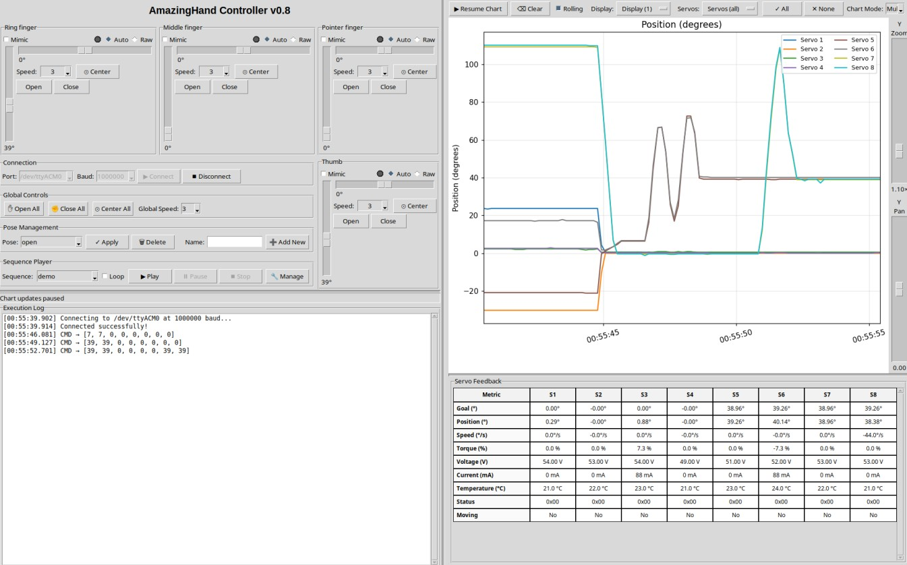

Project is licensed under [Apache 2.0](https://www.apache.org/licenses/LICENSE-2.0)

Mechanical design is licensed under a:
[Creative Commons Attribution 4.0 International License][cc-by].
[![CC BY 4.0][cc-by-image]][cc-by]
[![CC BY 4.0][cc-by-shield]][cc-by]

[cc-by]: http://creativecommons.org/licenses/by/4.0/
[cc-by-image]: https://licensebuttons.net/l/by/4.0/88x31.png
[cc-by-shield]: https://img.shields.io/badge/License-CC%20BY-lightgrey.svg

# Amazing Hand project

Robotic hands are often very expensive and not so expressive. More dexterous ones often need cables and deported actuators in the forearm, i.e.,

Amazing Hand is:
- 8 dofs humanoid hand with 4 fingers
- 2 phalanxes per finger articulated together
- flexible shells almost everywhere
- All actuators inside the hand, without any cables
- 3D printable
- 400g weight
- low-cost
- open-source

[AmazingHand_Overview](/docs/AmazingHand_Overview.pdf)

Each finger is driven by a parallel mechanism. 
That means 2x small Feetech servos are used to move each finger in flexion/extension and abduction/adduction

Two control methods are available:
- Use a serial bus driver (Waveshare i.e.) + Python script
- Use an Arduino + Feetech TTL Linker

Detailed explanations are available for both ways, and basic demo software is also available. Up to you !

## 2 versions exist :
- with SCS0009 (Original Amazing Hand) => <200€
- with STS3032 (Amazing Hand Enhanced) => <350€ (see Amazing Hand Enhanced folder https://github.com/pollen-robotics/AmazingHand/tree/Amazing-Hand-Enhanced/AmazingHand_Enhanced)

## Table of contents

- [Build Resources](#build-resources)
    - [BOM (Bill Of Materials)](#bom-bill-of-materials)
    - [CAD Files and Onshape document](#cad-files-and-onshape-document)
    - [Assembly Guide](#assembly-guide)
    - [Run_basic_Demo](#run-basic-demo)    
- [Disclaimer](#disclaimer)
- [AmazingHand advanced Demo](#amazinghand-advanced-demo)   
- [Don't want to build it by yourself? Kits are available!](#don't-want-to-build-it-by-yourself-?)    
- [Project Updates & Community](#project-updates-&-community)
    - [To Do List](#to-do-list)
    - [FAQ](#faq)
    - [Contact](#contact)
    - [Thank you](#thank-you)

# Build Resources
## BOM (Bill Of Materials)
List of all needed components is available here:  
[AmazingHand BOM](https://docs.google.com/spreadsheets/d/1QH2ePseqXjAhkWdS9oBYAcHPrxaxkSRCgM_kOK0m52E/edit?gid=1269903342#gid=1269903342)  

And remember to add control choice cost (2 options detailed previously)

Details for custom 3D printed parts are here: 
[3Dprinted parts](https://docs.google.com/spreadsheets/d/1QH2ePseqXjAhkWdS9oBYAcHPrxaxkSRCgM_kOK0m52E/edit?gid=2050623549#gid=2050623549)

Here is a guide explaining how to print all the needed custom parts:
[=> 3D Printing Guide](/docs/AmazingHand_3DprintingTips.pdf)
 

## CAD Files and Onshape document
STL and Steps files can be found [here](https://github.com/pollen-robotics/AmazingHand/tree/main/cad) 

Note that fingers are the same if you want to build a left hand, but some parts are symmetrical. Specific right hand parts are preceded by an "R", and other left hand parts by an "L".

Everyone can access the Onshape document too:   
[Link Onshape](https://cad.onshape.com/documents/430ff184cf3dd9557aaff2be/w/e3658b7152c139971d22c688/e/bd399bf1860732c6c6a2ee45?renderMode=0&uiState=6867fd3ef773466d059edf0c)  

Note that predefined positions are available in the "named position" tooling, with corresponding servo angles

  

## Assembly Guide

Assembly guide for the Amazing Hand in combination with standard components in the BOM is here:  
[=> Assembly Guide](/docs/AmazingHand_Assembly.pdf)  
  

You will need a simple program / script to calibrate each finger, available here:
- With Python & Waveshare serial bus driver: [here](https://github.com/pollen-robotics/AmazingHand/tree/main/PythonExample)
- With Arduino & TTLinker: [here](https://github.com/pollen-robotics/AmazingHand/tree/main/ArduinoExample)

Note that this assembly guide is for a standalone right hand.

If you need to build a standalone left hand, you can keep the same IDs for servo locations, and select if it's a right or left hand in the software.

## Run basic Demo

A basic demo is available with both Python & Arduino.

You will need an external power supply to be able to power the 8 actuators inside the hand.

If you don't have one already, a simple external power supply could be a DC/DC 220V -> 5V / 2A adapter with jack connector.
Check on the BOM list:
[AmazingHand BOM](https://docs.google.com/spreadsheets/d/1QH2ePseqXjAhkWdS9oBYAcHPrxaxkSRCgM_kOK0m52E/edit?gid=1269903342#gid=1269903342) 

- Python script: "AmazingHand_Demo.py" [here](https://github.com/pollen-robotics/AmazingHand/tree/main/ArduinoExample)
  
- Arduino program: "AmazingHand_Demo.ino" [here](https://github.com/pollen-robotics/AmazingHand/tree/main/PythonExample)

https://github.com/user-attachments/assets/485fc1f4-cc57-4e59-90b5-e84518b9fed0

## You need both right & left hands on the same bus ?

If you need to build both right and left hands to plug them on a robot, you will have to attribute different IDs for right and left hands. You can't have same ID for different servos on the same serial bus...
Very important thing is to keep same assembly order for servos, but set them different IDs than for the right hand, as follows:

Specific software is also needed, in order to drive each hand independently.
This simple demo runs the same hand patterns on both hands simultaneously, but it's only available in Python:
"AmazingHand_Demo_Both" [here](https://github.com/pollen-robotics/AmazingHand/tree/main/PythonExample)

# Disclaimer

I noticed some variations between theoretical angles for Flexion / Extension, Abduction / Adduction and angles in real life prototypes. This is probably due to several sources of variation (3D printed parts are not perfect, balljoint rods are manually adjusted one by one, servo horn rework, flexibility of plastic parts...).

This design has not yet been tested for long and complex prehensile tasks. Before being able to grasp objects safely (that means without damaging servos or mechanical parts), a kind of smart software needs to be built.
SCS0009 servos have smart capabilities as:
- Torque enable / disable
- Torque feedback
- Current position sensor
- Heat temperature feedback
- ...

# AmazingHand advanced Demo

For more advanced usage using inverse/forward kinematics there are several examples in the [Demo](Demo) directory along with some useful tools to test/configure the motors.

# Don't want to build it by yourself?
=> Kits are available here :

Seeed Studio :
https://www.seeedstudio.com/Amazing-Hand-Right-Hand-The-Open-Source-Robotic-Hand-Developer-Kit.html

WowRobo :
https://shop.wowrobo.com/products/amazing-hand-the-open-source-robotic-hand-kit

# Project Updates & Community
## Updates from community

- ### Amazing Base for the amazing hand : 

STL or Step file can be found [here](https://github.com/pollen-robotics/AmazingHand/tree/main/cad) 

- ### Specific Chinese BOM available here :
[Chinese BOM](https://docs.google.com/spreadsheets/d/1fHZiTky79vyZwICj5UGP2c_RiuLLm89K8HrB3vpb2h4/edit?gid=837395814#gid=837395814)

Thanks to Jianliang Shen !

- ### Amazing Hand Control : Python GUI and CLI tools for controlling the AmazingHand
Key features :
- Control the fingers independently
- Real time monitoring of servo feedbacks
- Create custom animations by saving positions and replaying them sequentially
  

Link to repository : [Link](https://github.com/Betatester777/AmazingHandControl)

Thanks to Betatester777 !

- ### Amazing hand with SG90 servos + force control setup 🔥

GitHub with code: (https://github.com/joanbox24/AmazingHand-with-sg90-servo-force-control)

- ### Amazing hand interface for SO-Arm 🔥

STL or Step file can be found [here](https://github.com/pollen-robotics/AmazingHand/tree/main/cad)
Or directly on onshape workspace, folder "community update"

## To Do List
- Design small custom pcb with serial hub and power supply functions, to fit everything in the hand
- Test with prehensile tasks 
      => Add smarter behaviour for closing hand, based on available motors feedbacks
- Study possibility to have 4 different fingers length, or add a 5th finger
- Study possibility to use STS3032 Feetech motors instead of SCS0009
      => Stronger for quite the same volume, but servo horn is different
- Study possibility to add compliancy by replacing rigid links to springs
- Add fingertip sensor to push one step higher smart control

## FAQ
WIP

## Contact

You can reach public discord channel here : 
[Discord AmazingHand](https://discord.com/channels/519098054377340948/1395021147346698300)

Or 
[Contact me or Pollen Robotics](/docs/contact.md)

## Thank you
Huge thanks to those who have contributed to this project so far:
- [Steve N'Guyen](https://github.com/SteveNguyen) for beta testing, Feetech motors integration in Rustypot, Mujoco/Mink and hand tracking demo
- [Pierre Rouanet](https://github.com/pierre-rouanet) for Feetech motors integration in pypot  
- [Augustin Crampette](https://fr.linkedin.com/in/augustin-crampette) & [Matthieu Lapeyre](https://www.linkedin.com/in/matthieulapeyre/) for open discussions and mechanical advices
